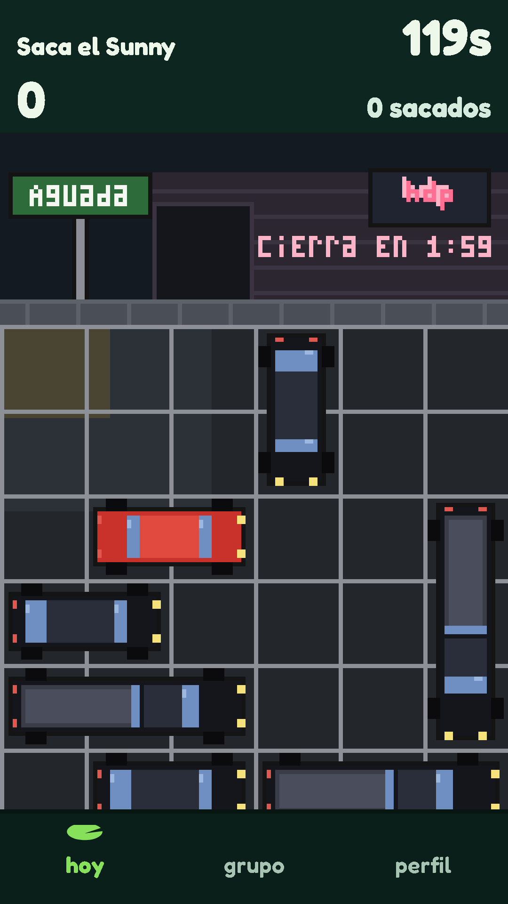

# Juego nuevo: Saca el Sunny

Publicado en producción (https://playus-lake.vercel.app) el 2026-10-08.

## Qué es

Un Rush Hour: el sunny rojo está estacionado en Aguada, trabado entre autos negros que se mueven solo en su dirección, y hay que sacarlo por la salida de su fila antes de que cierre la hdp. Cuando sale, viene otro estacionamiento más trabado. 120 segundos; 100 puntos por estacionamiento más un bonus de hasta 50 por usar los movimientos justos. Semilla por jugador: cada integrante recibe estacionamientos distintos, de dificultad pareja.

- Módulo `src/games/saca-el-sunny/` (`rules.ts` estacionamiento, resolvedor, generación, partida en ms, traza y `validate`; `sprites.ts`, `draw.ts`, `index.tsx`, `dev.tsx`). Decisiones 269 a 271. Reutiliza el neón de la hdp (`games/lib/hdp-kitchen`) y Big Bro (`games/lib/big-bro`); la fuente de 3 × 5 ganó el ":" y el arrastre de un dedo (`games/lib/pointer-drag`) un `onEnd` opcional.
- Resolvedor: búsqueda en anchura sobre las posiciones de todos los autos, con el mínimo y la solución paso a paso. Generación (`parkingPuzzles`): autos al azar con el máximo de la fila, el componente de estados alcanzables con una tabla de hash abierta (más de 12.000 estados se descarta), distancias desde las salidas, se quitan autos mientras no tenga solución, y el estado inicial se elige a una distancia sorteada dentro del rango de la fila. Tabla: 1: 5–6 autos, 4–6 movimientos; 2–3: 7–8, 7–10; 4–6: 9–10, 11–15; 7+: 11–13, 16–22.
- Costo: de 20 ms (los primeros) a 100–150 ms de mediana por estacionamiento en las filas altas (hasta medio segundo); se memorizan por semilla, el cliente arma el siguiente mientras el sunny sale, y `validate` rearma solo los jugados. Por eso el test de generación corre en 600 semillas (estacionamientos 1 y 2) y 120 (3 a 8), no en 10.000.
- Control: un dedo (o el mouse); el auto sigue al dedo sobre su eje, recortado a lo que puede moverse, lo perpendicular se ignora; al soltar queda en la casilla más cercana; soltar donde estaba no cuenta. `touch-action: none`. Casillas de 60 px en 360 px de ancho. "Empezar de nuevo" vuelve al principio con 0 movimientos y el reloj sigue.
- Calibración: el modelo (4 s mirando, 1,3 s por movimiento, un ida y vuelta de más) saca 6 sunnys (780 puntos); el rápido, 9–10; el lento, 4. Cota 8.100.
- Traza `{ t, puzzle, type: 'move', car, delta }` / `{ t, puzzle, type: 'reset' }`; `validate` rearma los estacionamientos con la semilla del jugador, recalcula los mínimos y rechaza puntajes inflados, movimientos imposibles (atraviesan o salen de la grilla), autos inexistentes, movimientos sin cambio, estacionamientos salteados, intervalos menores a 80 ms, tiempos fuera de orden o pasados de 120 s, eventos mientras sale el sunny, y duración incoherente. Un movimiento "de costado" no se puede escribir en la traza.
- Arte: calle de noche con el cartel "Aguada", la pared de la hdp con el neón y "cierra en m:ss" en vivo, la puerta con la persiana; en los últimos 15 s el neón titila y Big Bro aparece bajando la persiana; al cerrar, la pantalla de resultado muestra el neón apagado, "cerró la hdp" y los sunnys sacados. Asfalto con líneas, luz de farol y la flecha de la salida; autos negros con brillos azulados en tres siluetas (sedán, hatchback, camioneta de 3) y el sunny rojo sin logos. Al sacarlo arranca con una estela, "+150" (o lo que sumó) y el siguiente sube desde abajo; con reducir movimiento, sin estela ni titileo.
- Herramienta `/dev/juego/saca-el-sunny?seed=…&solucion=1&lento=1&desde=N&cierre=S`: solución óptima paso a paso, mínimos de cada estacionamiento, saltar a cualquiera, distribución en 50 semillas, y arrancar en los últimos segundos para ver el cierre.

## Comprobaciones

- `vitest`: 14 tests del juego (resolvedor en puzzles a mano con mínimo conocido y uno sin solución; movimientos legales; `parkingPuzzles` determinística; generación en 600 + 120 semillas: solución, fila, sunny en la tercera fila, cantidad de autos, sin superposiciones, mínimo confirmado por el resolvedor; reglas: varias casillas = un movimiento, soltar donde estaba no cuenta, empezar de nuevo; puntaje 150/120/100 y solo desde el último reinicio; cota; `validate` acepta partidas reales y rechaza cada caso pedido, incluidas trazas de otro jugador y del grupo; calibración; arrastre y arte). Semilla por jugador: los tests de `attempts.test.ts` ya cubren la extensión y comprueban que este juego la declara. Suite completa en verde; `eslint`, `tsc` y `next build` limpios.
- E2E local (`e2e/saca-sunny.spec.ts`, 3 tests): estacionamientos, resolvedor y partida del modelo idénticos en navegador y Node en 4 semillas; previa, herramienta (mínimos, solución, distribución), área (`touch-action: none`), un arrastre de costado que no mueve nada, uno sobre el eje que cuenta y "empezar de nuevo"; ronda real con dos jugadores del mismo grupo que reciben estacionamientos distintos, y una partida que resuelve dos con el resolvedor y llega al ranking con 300 puntos (la traza reproducida en Node y rechazada con la semilla del otro).
- E2E en producción (`SUPABASE_CLI=supabase@2.119.0 E2E_BASE_URL=https://playus-lake.vercel.app npx playwright test e2e/saca-sunny.spec.ts -g "ronda real"`): en verde (2,6 min, la partida dura los 120 s) contra el deploy `playus-fvx27duno`: grupo nuevo con el juego del día puesto en la base, un segundo jugador que entra por el link, semillas y estacionamientos distintos para los dos, dos estacionamientos resueltos con el resolvedor, 300 puntos en el ranking y la traza reproducida en Node (y rechazada con la semilla del otro).
- `/dev/juego/saca-el-sunny` responde 404 en producción sin sesión de admin.
- Juego de hoy (2026-10-08) en todos los grupos de producción: puesto con `admin_set_today_game` (una transacción por grupo, registro en `admin_actions`), 16 grupos, 16 rondas cambiadas (2 intentos borrados, del E2E anterior); verificado en la base: 17 rondas de hoy con `saca-el-sunny` (las 16 más la del grupo del E2E de producción, con sus 2 intentos), la semilla de la fórmula.

## Capturas

- `reports/saca-el-sunny/previa.png`: la pantalla previa.
- `reports/saca-el-sunny/trabado.png`: un estacionamiento trabado (el 4).
- `reports/saca-el-sunny/saliendo.png`: el sunny saliendo con "+150".
- `reports/saca-el-sunny/cierre-cerca.png`: los últimos 15 s, el neón titilando y Big Bro bajando la persiana.
- `reports/saca-el-sunny/cerro.png`: el final "cerró la hdp".

## De borde a borde (2026-10-09)

A pedido del dueño ("la pantalla de juego quedó demasiado chica"), el estacionamiento ocupa ahora todo el ancho y el alto disponibles (decisión 272): el contenedor tiene una opción nueva `fullscreen`, el canvas se escala con fracción hasta los bordes y la franja de la calle es más baja. La simulación, las reglas y `validate` no cambiaron.

| pantalla | casilla antes | casilla después | se desplazaba antes | después |
|---|---|---|---|---|
| 360 × 640 | 40 px | **60 px** | sí | no |
| 390 × 844 | 53 px | **65 px** | sí | no |
| 412 × 915 | 60 px | **69 px** | sí | no |

- Antes: `reports/saca-el-sunny/tamano-antes-360x640.png`, `tamano-antes-390x844.png` y `tamano-antes-412x915.png` (en la herramienta, con la página corrida hasta el área de juego).
- Después: `reports/saca-el-sunny/tamano-despues-360x640.png`, `tamano-despues-390x844.png` y `tamano-despues-412x915.png`.
- Comprobado: los 14 tests del juego y la suite completa (461) en verde, `eslint`, `tsc` y `next build` limpios, y los 3 E2E del juego en local. En producción (deploy `playus-bnh6t3ic7`): `/dev/juego/saca-el-sunny` da 404, la ronda real pasa (dos jugadores con estacionamientos distintos, 300 puntos en el ranking) y en `/hoy/jugar` a 360×640 el canvas mide 360×480 en x 0, casillas de 60 px, el botón termina en 634 y la página no se desplaza (640/640).

